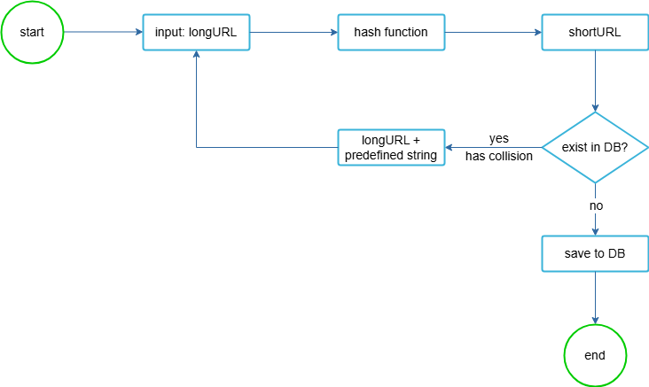

# URL Shortener System Design

This repository contains the design and implementation of a scalable URL Shortener service similar to TinyURL. The system supports millions of URL creations and redirects per day, with high availability and low latency.

---

## Table of Contents

- [Problem Statement](#problem-statement)
- [System Requirements](#system-requirements)
- [High-Level Architecture](#high-level-architecture)
- [Components Description](#components-description)
- [Data Model](#data-model)
- [URL Shortening Flow](#url-shortening-flow)
- [URL Redirecting Flow](#url-redirecting-flow)
- [Scaling & Performance](#scaling--performance)
- [Analytics & Monitoring](#analytics--monitoring)
- [References](#references)

---

## Problem Statement

A URL shortener converts a long URL into a shorter alias for easier sharing and tracking.

**Example:**

- Original URL:  
`https://www.systeminterview.com/q=chatsystem&c=loggedin&v=v3&l=long`
- Shortened URL:  
`https://tinyurl.com/y7keocwj`

**Primary Operations:**

1. **URL Shortening:** Generate a short URL for a given long URL.
2. **URL Redirecting:** Redirect from a short URL to its original long URL.

---

## System Requirements

- **Write Volume:** 100M URLs/day (~1160 writes/sec)
- **Read Volume:** 10x read-to-write ratio (~11,600 reads/sec)
- **Storage:** ~365 billion URLs in 10 years (~36.5 TB)
- **Short URL:** 7-character base62 string
- **High Availability, Scalability, and Fault Tolerance**
- **Optional Analytics:** Click tracking and usage metrics

---

## High-Level Architecture

**Legend:**

- User → Clients (desktop, mobile)
- API Gateway → Handles auth, authorization, rate limiting, and load balancing
- Shortener Service → Core service for URL creation
- User Service → Stores user roles and profiles
- Cache → Redis cluster for fast shortURL → longURL lookup
- Database → Cassandra / BigTable / HBase for persistent storage
- Analytics Service → Captures click metrics and events
- Kafka → Message queue for analytics events
- Raw Events Storage → S3/HDFS/GCS
- Bloom Filter → Space-efficient check for existing URLs
- App-specific metadata → DynamoDB

---

## Components Description

### API Gateway
- Routes requests to services
- Performs authentication and authorization
- Rate limiting to prevent abuse
- Load balancing across web servers

### User Service
- Stores user profiles, roles, and preferences
- Integrates with third-party IDPs like Auth0, Keycloak
- Provides metadata to Shortener service

### Shortener Service
- Generates new short URLs using Base62 encoding
- Checks for existing long URLs to avoid duplicates
- Interacts with cache and database
- Sends events to Analytics service

### Cache (Redis)
- Stores `<shortURL, longURL>` mappings
- Reduces database load for high-read traffic

### Database (Cassandra / BigTable / HBase)
- Stores persistent `<id, shortURL, longURL>` records
- Handles high throughput and large-scale data

### Bloom Filter
- Helps quickly check if a URL might exist
- Reduces unnecessary database queries

### Analytics Service
- Consumes events from Kafka
- Writes aggregated metrics to Redis, ClickHouse, or Elasticsearch
- Stores raw events to S3/HDFS/GCS

---

## Data Model

**Table: `url`**

| Column    | Type    | Description                     |
|----------|---------|---------------------------------|
| id       | bigint  | Primary key, unique ID           |
| shortURL | string  | Shortened URL string             |
| longURL  | string  | Original long URL                |
| userID   | string  | Optional, creator of the URL     |
| createdAt| timestamp | Timestamp of creation          |

**User Table:**

| Column  | Type   | Description |
|---------|--------|-------------|
| userID  | string | Unique ID for user |
| role    | string | User role (Admin/User) |
| profile | JSON   | Preferences or metadata |

---

## URL Shortening Flow

1. User sends POST request to API Gateway with a long URL.
2. API Gateway forwards request to Shortener Service.
3. Shortener Service checks Bloom filter to see if URL exists.
4. If not found:
   - Generate unique ID
   - Convert ID to Base62 → short URL
   - Save `<id, shortURL, longURL>` to database
   - Update Bloom filter
5. Return short URL to user
6. Send analytics event to Kafka

---

## URL Redirecting Flow

1. User clicks short URL
2. API Gateway forwards GET request to Shortener Service
3. Shortener Service checks cache:
   - If found → return long URL
   - If not → fetch from DB → update cache → return long URL
4. HTTP redirect response sent to client
5. Analytics event logged

---

## Scaling & Performance

- **Stateless Web Tier:** Horizontally scalable
- **Database:** Sharding and replication for high availability
- **Cache Layer:** Reduces DB load
- **Bloom Filter:** Prevents unnecessary DB lookups
- **Rate Limiting:** Protects system from abuse

---

## Analytics & Monitoring

- Clickstream events captured via Kafka
- Metrics stored in Redis, ClickHouse, Cassandra, Elasticsearch
- Raw events backed up in S3/HDFS/GCS
- Provides insights: clicks per URL, user engagement, geographic distribution

---

## References

1. [Base62 Encoding](https://en.wikipedia.org/wiki/Base62)
2. [Bloom Filter](https://en.wikipedia.org/wiki/Bloom_filter)
3. [Distributed Unique ID Generation](https://en.wikipedia.org/wiki/Unique_identifier)
4. [REST API Design](https://restfulapi.net/)
